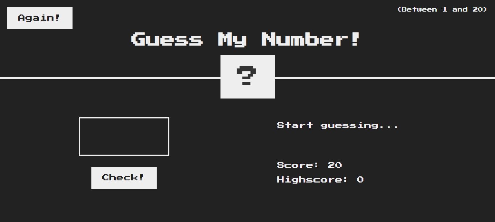

<h1 align="center">Guess-The-Num-Game</h1>

 
<h2>Made a Guess The Number Game based on the concept  of High-Low. </h2>

The game is a practice code from Jonas Schmetmann's Complete JavaScript Course on Udemy. The game is solely based on learning Javascript. The game works on Principle of high low, you have to guess a Secret Number. The game lets you know if your value is high or lower than the Secret Number and reduces points based on the incorrect guesses.

<h2>A Highlight of Javascript Concepts Learned -</h2>
<li>Calling a class from HTML in JavaScript</li>
<li>Handling Event Listners</li>
<li>Handling CSS properties from  Javascript</li>
<li>Optimizing Code for better performance</li>
